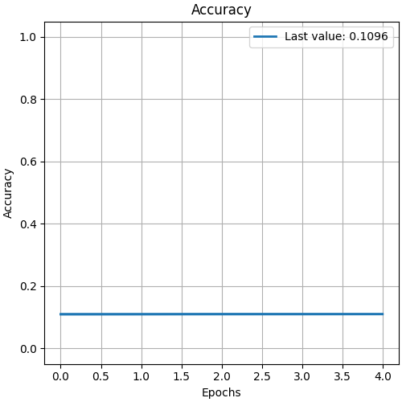
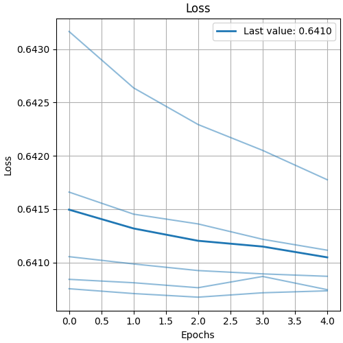
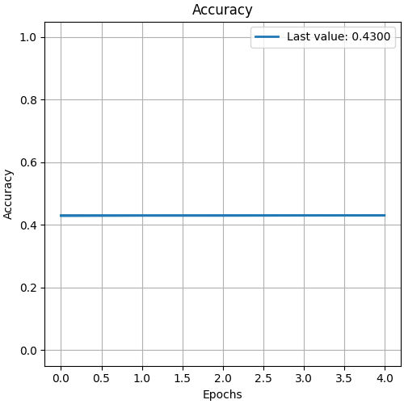
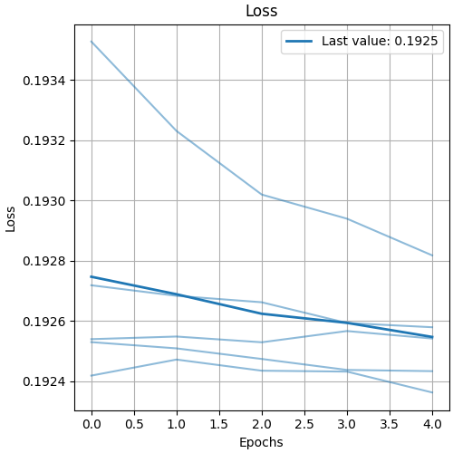
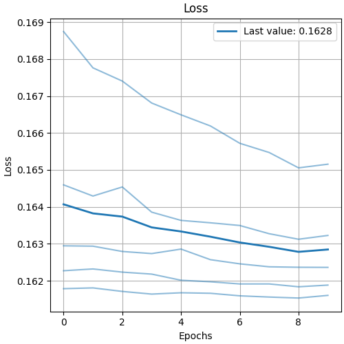
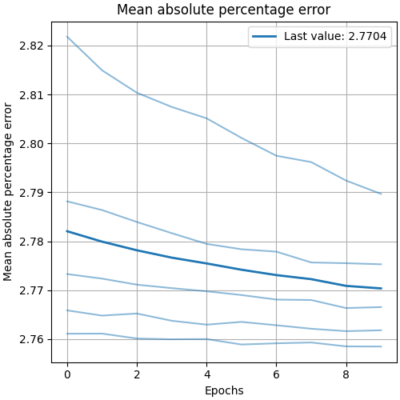
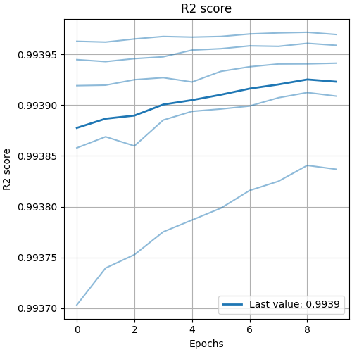

# Loan Interest Rate Predictions

## Team

### Luz Aguilar, Scott McNiff, Melanie Runser, Owen Sull, & Jerry Youngblood

## Objective and Requirements

The objective of this project was to apply machine learning (ML) by employing a predictive model to a dataset, arriving at a targeted variable within that dataset at a high degree of accuracy.

Requirements included cleaning, normalizing, and standardizing the data before modeling, then utilizing Spark to retrieve the data and a Python script to initiate, train, and evaluate a model. The model was to demonstrate at least 75% classification accuracy or 0.80 R-squared, with model optimization performed as needed to attain that level of accuracy.

## Data Source and Characteristics

The particular dataset used was one on Lending Club (LC) loan data for all loans issued by LC from 2007 through 2018.

The Database Contents License for the dataset grants the user 'a worldwide, royalty-free, non-exclusive, perpetual, irrevocable copyright license' as well as 'permission for any information having copyright contained in the [dataset] Contents.' Accordingly, copyright or license considerations were fulfilled, and by virtue of the 'id' and 'member_id' columns in the dataset being empty and no other individual identifiable information being present, privacy considerations were satisfied as well.

The dataset appeared in csv format ([loan.csv](Data_Source/loan.csv)). Its shape was bounded by  2,260,668 rows across 145 columns, most of which contained float d types but also included integers and objects. Total memory usage was 2.4+ GB.

The dataset was accompanied by a three-tab [data dictionary](Data_Source/LCDataDictionary.xlsx) (xlsx format) in which each tab listed column names and their corresponding definitions.

## Data Processing and Analysis

Extensive review of the data dictionary was done to understand the columns in the dataset and the kind of information contained. Then, an initial normalizing of the data was performed to see, relative to loan status/default rates, several areas for possible further inquiry. Those areas included grade and sub-grade distribution, loan defaults for 60-month loans vs 36-month ones, home ownership status, loan purpose, loan amounts and installment amounts, income and debt-to-income levels, and interest rates.

After initial modeling was performed, the dataset was further examined and considered for refinement. Analysis revealed a significant number of columns that were less-than-fully populated with values and a few columns that were even empty. Accordingly, those columns were eliminated, leaving only the ones that contained a full set of values.

In addition, investigation of the data in terms of years determined that more than 40% of the dataset was concentrated in the years 2017 and 2018 alone. Considering that as a significant representation for modeling purposes, those years were selected as the ones to draw from, and the dataset was further limited to them. Reshaping of the dataset, then, reduced it to a more manageable one containing 938,821 rows and 50 columns and a memory usage of 365.3+ MB.

The final dataset was accordingly saved to a new [csv file](Data_Source/LC_loans_2017-2018.csv).

## Data Modeling Approach and Results

A [predictive model](neural_network.ipynb) was initiated using the original dataset and sub-grades as the target, but still with select columns (a dozen or less) as features, considering how their number would expand with use of get_dummies() and consequently exceed memory constraints. Rows with null values were also dropped. With the StandardScaler applied, and three neural network layers made using sigmoid and softmax activations, the model was fitted, and epochs run. Early accuracy readings were merely 10.7%, however, with a top two predictions accuracy of only 20.3%. Further optimization was certainly needed, and because sub-grades totaled 35 by count, but grades only 7, grade became the substitute target for sub-grade.

The build-up to a model with grade as target was followed as previously for sub-grade with use of the same three neural network layers. The model was fitted, and as epochs were generated, they revealed accuracy to be much higher than for sub-grades but still only in the 41-43% range with a top two predictions accuracy of 71.7%. Consequently, the dataset and columns that had been selected as features were revisited.

Upon more analysis of those, it was determined that the entire dataset could be reshaped as described above (Data Processing and Analysis), reducing its columns by nearly a third and cutting its number of rows by more than half. In addition, it was further observed that loan grade influences interest rate, but interest rate does not drive loan grade.

In light of those observations, another model was initiated with the reshaped dataset and a new target of interest rate instead of grade. Also, a different selection of columns was made, considering the changes to the original dataset and particular inclusion of sub-grade as a feature given its increased granularity in contrast to grades. In addition, four layers versus three were used for the neural network, repeating usage of sigmoid but exchanging softmax for linear. With the model accordingly fitted, epochs were started and immediately began showing achievement of 99.4% accuracy.

Visualizations were then prepared to demonstrate relationships between features and the target of interest rate.

### Correlation of Features to Interest Rate

[text](<../../../Documents/Occupation/6_Upskilling/Edu/UNCC/Group Projects/Group Project 4/Correlations_IntRate.pptx>)

### Loan Amount by Annual Income

[text](<../../../Documents/Occupation/6_Upskilling/Edu/UNCC/Group Projects/Group Project 4/LoanAmt_Annl_Income.pptx>)

### Credit Rating and Interest Rate

[text](<../../../Documents/Occupation/6_Upskilling/Edu/UNCC/Group Projects/Group Project 4/CrRating_IntRate.pptx>)

### Type of loan applied for and average interest rates given

[text](<../../../Documents/Occupation/6_Upskilling/Edu/UNCC/Group Projects/Group Project 4/LoanType_IntRate.pptx>)

### Low-to-Medium Income and Interest Rates

[text](<../../../Documents/Occupation/6_Upskilling/Edu/UNCC/Group Projects/Group Project 4/Low-MedIncome_IntRate.pptx>)

### High Income and Interest Rates

[text](<../../../Documents/Occupation/6_Upskilling/Edu/UNCC/Group Projects/Group Project 4/HighIncome_IntRate.pptx>)

### Interest Rates by State

[text](<../../../Documents/Occupation/6_Upskilling/Edu/UNCC/Group Projects/Group Project 4/States_IntRate.pptx>)

## Technological Resources

Several tools/libraries and applications were used in this project. Python Pandas - along with Matplotlib, NumPy, Re, Sci-Kit Learn, SciPy, Seaborn, and StatsModels - were imported into Jupyter notebooks for data processing and early analysis. Sci-Kit Learn, TensorFlow, and Keras were imported into a separate Jupyter notebook to initiate and execute the neural network models. Matplotlib, Seaborn, and Tableau were relied upon for data visualizations.

## Usage & Contributing

This project is not open for contributions, as it is a homework assignment only. Please do not copy, modify, or distribute this code without permission.

## Credits

We utilized multiple resources for clarification, to determine error sources, etc.
*
*
*

## Sources

<https://www.kaggle.com/datasets/adarshsng/lending-club-loan-data-csv>
<https://www.lendingclub.com/glossary>
<https://www.informatica.com/resources/articles/what-is-etl.html> (ETL diagram image)
<https://pypi.org/project/plot-keras-history/>
<https://stackoverflow.com/questions/37532098/split-dataframe-into-two-on-the-basis-of-date>
